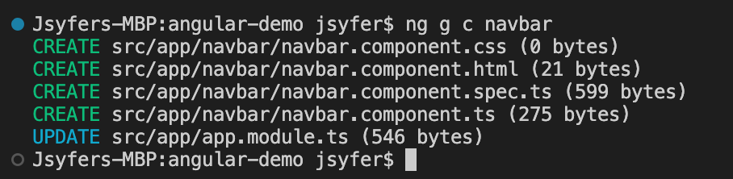
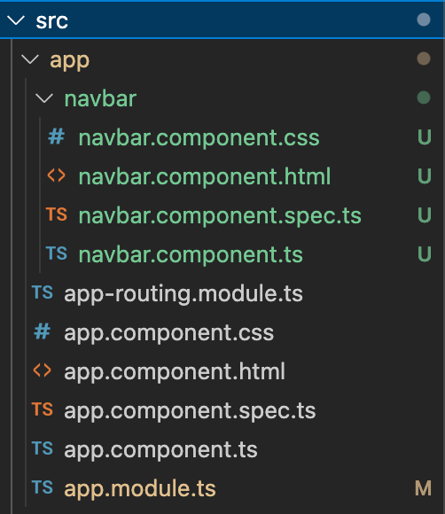
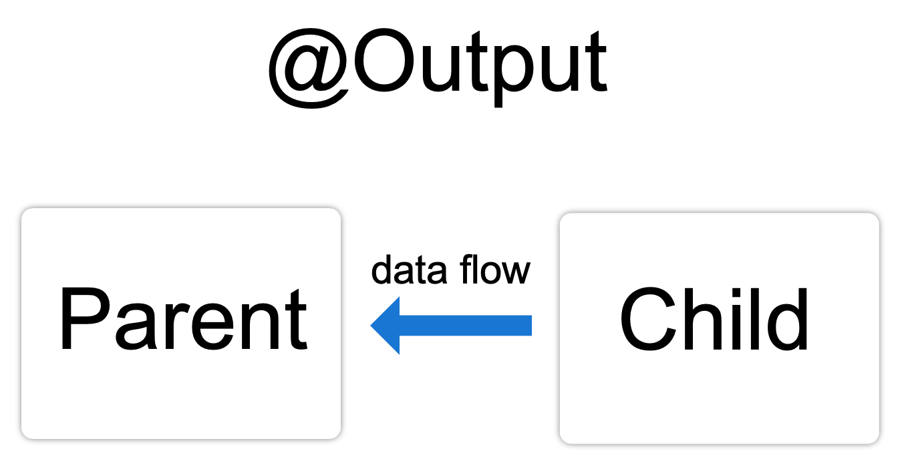
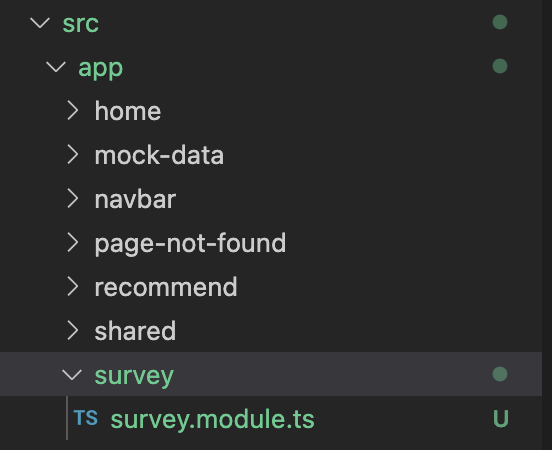

# 概要

- 组件(Components)
- 服务(Service)
- 模块(Module)
- 路由器(Router)

# 组件(Components)

[https://angular.cn/guide/component-overview](https://angular.cn/guide/component-overview)

## Angular Components 概述

组件是 Angular 应用的主要构造块。每个组件包括如下部分：

- 一个 HTML 模板，用于声明页面要渲染的内容
- 一个用于定义行为的 TypeScript 类
- 一个 CSS 选择器，用于定义组件在模板中的使用方式
- （可选）要应用在模板上的 CSS 样式

## 创建方法

使用 Angular CLI 创建组件

1. 在终端窗口中，导航到要放置你应用的目录。
2. 运行 `ng generate component <component-name>`命令，其中 `<component-name>` 是新组件的名字。

默认情况下，该命令会创建以下内容：

- 一个以该组件命名的文件夹
- 一个组件文件 `<component-name>.component.ts`
- 一个模板文件 `<component-name>.component.html`
- 一个 CSS 文件，`<component-name>.component.css`
- 测试文件 `<component-name>.component.spec.ts`

并自动把模块导入至 app.module.ts

## 组件之间的数据共享

[https://angular.cn/guide/inputs-outputs](https://angular.cn/guide/inputs-outputs)

# 服务(Service)

[https://angular.cn/guide/architecture-services](https://angular.cn/guide/architecture-services)

服务是一个广义的概念，它包括应用所需的任何值、函数或特性。狭义的服务是一个<mark>明确定义了用途的类</mark>。它应该做一些具体的事，并做好。

Angular 把组件和服务区分开，以提高模块性和复用性。通过把组件中和视图有关的功能与其它类型的处理分离开，你可以让组件类更加精简、高效。

理想情况下，组件的工作只管用户体验，而不用顾及其它。它应该提供用于数据绑定的属性和方法，以便作为视图（由模板渲染）和应用逻辑（通常包含一些模型的概念）的中介者。

<mark>组件应该把诸如从服务器获取数据、验证用户输入或直接往控制台中写日志等工作委托给各种服务</mark>。通过把各种处理任务定义到可注入的服务类中，你可以让它被任何组件使用。通过在不同的环境中注入同一种服务的不同提供者，你还可以让你的应用更具适应性。

Angular 不会强迫你遵循这些原则。Angular 只会通过依赖注入来帮你更容易地将应用逻辑分解为服务，并让这些服务可用于各个组件中。

## 创建方法

1. 在终端窗口中，导航到要放置你应用的目录。
2. 运行 `ng generate service <service-name>`命令，其中 `<service-name>` 是新组件的名字。

默认情况下，该命令会创建以下内容：

- 一个服务文件 `<service-name>.service.ts`

## 常见用法

- 组件之间的通信
- 外部服务的通信

# 模块(Module)

[https://angular.cn/guide/architecture-modules](https://angular.cn/guide/architecture-modules)

Angular 应用是模块化的，它拥有自己的模块化系统，称作 NgModule。一个 NgModule 就是<mark>一个容器</mark>，用于存放一些内聚的代码块，这些代码块<mark>专注于某个应用领域</mark>、某个工作流或一组紧密相关的功能。它可以包含一些组件、服务提供者或其它代码文件，其作用域由包含它们的 NgModule 定义。它还可以导入一些由其它模块中导出的功能，并导出一些指定的功能供其它 NgModule 使用。

## 创建方法

1. 在终端窗口中，导航到要放置你应用的目录。
2. 运行 `ng generate module <module-name>`命令，其中 `<module-name>` 是新组件的名字。

默认情况下，该命令会创建以下内容：

- 一个以该模块命名的文件夹
- 一个模块文件 `<module-name>.module.ts`

## 模块和组件的关系

[https://angular.cn/guide/architecture-modules#ngmodules-and-components](https://angular.cn/guide/architecture-modules#ngmodules-and-components)

NgModule 为其中的组件提供了一个编译上下文环境。根模块总会有一个根组件，并在引导期间创建它。但是，任何模块都能包含任意数量的其它组件，这些组件可以通过路由器加载，也可以通过模板创建。那些属于这个 NgModule 的组件会共享同一个编译上下文环境。

组件及其模板共同定义视图。组件还可以包含视图层次结构，它能让你定义任意复杂的屏幕区域，可以将其作为一个整体进行创建、修改和销毁。一个视图层次结构中可以混合使用由不同 NgModule 中的组件定义的视图。这种情况很常见，特别是对一些 UI 库来说。

[https://angular.cn/guide/architecture-modules#ngmodules-and-javascript-modules](https://angular.cn/guide/architecture-modules#ngmodules-and-javascript-modules)

# 路由器(Router)

[https://angular.cn/guide/router-reference](https://angular.cn/guide/router-reference)

Angular 的 Router 是一个可选服务，它为指定的 URL 提供特定的组件视图。它不是 Angular 核心的一部分，因此它位于自己的包 `@angular/router` 中。

## 模块和服务 lazyload

[https://angular.io/guide/providers#limiting-provider-scope-by-lazy-loading-modules](https://angular.io/guide/providers#limiting-provider-scope-by-lazy-loading-modules)

# 风格指南

[https://angular.cn/guide/styleguide](https://angular.cn/guide/styleguide)

- [特性模块](https://angular.cn/guide/styleguide#feature-modules) (Feature modules)
- [共享特性模块](https://angular.cn/guide/styleguide#shared-feature-module) (Shared feature module)
